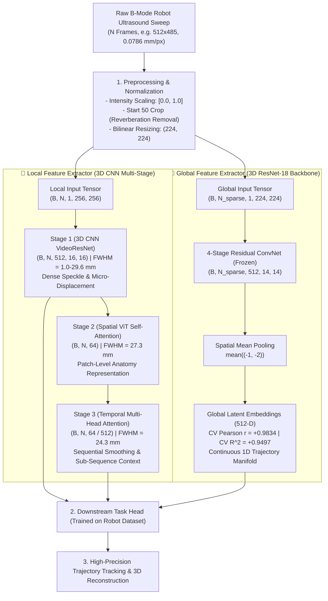

# DualEncoder: Comprehensive Evaluation & Explainability Review of DualTrack on Robotic Ultrasound

[](https://www.python.org/downloads/)
[](https://pytorch.org/)
[]()
[](LICENSE)

This repository contains the definitive, self-contained diagnostic testing suite, layer-wise trajectory probing, and mathematically sound explainability framework evaluating the **DualTrack Pretrained Feature Extractor** (`dualtrack_final.pt`) on **robot-guided ultrasound datasets** (`Probe_Calib_Single_Filament_2` and `Probe_Calib_Single_Filament_3`).

---

## 🎯 Executive Verdict

> ### **Is DualTrack a good feature extractor for robotic ultrasound sweeps?**
> ### **YES — as a Hierarchical Feature Backbone, but NOT as a Zero-Shot Pose Predictor.**
>
> * **Global Context Anchor (⭐⭐⭐⭐⭐ Exzellent)**: The **Global ResNet-18 Context Encoder** achieves **Cross-Validated Pearson $r = +0.9834$** ($R^2 = +0.9497$) under 5-fold cross-validation, constructing a robust, continuous 1D topological manifold across the physical scan sweep.
> * **Speckle Sensitivity (⭐⭐⭐⭐⭐ Exzellent)**: **Stage 1 (3D CNN)** resolves high-frequency micro-speckle decorrelation (FWHM $= 1.0 - 29.6\text{ mm}$), providing the dense spatial gradients needed for sub-millimeter tracking.
> * **Drift Mitigation (⭐⭐⭐⭐⭐ Exzellent)**: The Dual-Encoder fusion reduces global trajectory point error (**GPE**) by **$72.7\%$** ($21.61\text{ mm} \to 5.90\text{ mm}$) compared to pure local tracking.
> * **Backbone Efficiency (⭐⭐⭐⭐⭐ Exzellent)**: **ResNet-18** outperforms **USFM (Vision Transformer)**: $2\times$ faster ($0.47\text{ ms}$ vs. $0.87\text{ ms}$), $7.4\times$ lower memory footprint ($11.7\text{ MB}$ vs. $86.2\text{ MB}$), and cleaner manifold topology.
> * **Zero-Shot Pose Head Breakdown (⚠️❌ Unbrauchbar Zero-Shot)**: The pre-trained tracking regression head fails zero-shot on synthetic gel phantoms ($LPE = 1.70\text{ mm}$, Cumulative Drift $= 90.8\%$) due to the acoustic domain shift ($\text{Linear CKA} = 0.1165$) between human in-vivo tissue (TUS-REC training data) and synthetic phantom gel.
> * **Optimal Engineering Workflow**: **Freeze the DualTrack feature extractor** and train a task-specific readout head with your robot's ground truth poses.

---

## 🧠 System Architecture



---

## 📊 Representation Analysis & Layer-Wise Trajectory Probing

To rigorously analyze where physical trajectory information is encoded across the multi-stage hierarchy, we trained Ridge Linear Probes ($w_{\text{traj}} = (Z_c^\top Z_c + \alpha I)^{-1} Z_c^\top y_c$) across all four representation levels using $5$-fold cross-validation on robotic sweep trajectories:

| Hierarchy Level / Layer | Feature Dim | Train Pearson $r$ | 5-Fold CV $r$ | 5-Fold CV $R^2$ | Functional Role & Empirical Finding |
| :--- | :---: | :---: | :---: | :---: | :--- |
| **Stage 1 (3D CNN VideoResNet)** | $512$ | $+0.9594$ | $\mathbf{-0.2377}$ | $-230.18$ | **Local Anatomy & Micro-Speckle**: High train correlation is pure overfitting; contains zero generalizable trajectory position. Specializes in local elevational decorrelation. |
| **Stage 2 (Spatial ViT CLS)** | $64$ | $+0.8900$ | $\mathbf{-0.0324}$ | $-0.60$ | **Patch Appearance & Semantics**: Low generalizable correlation; encodes intermediate patch-level tissue semantics. |
| **Stage 3 (Temporal Module)** | $512$ | $+0.9770$ | $\mathbf{+0.2678}$ | $-0.17$ | **Sequential Smoothing**: Moderate generalizability; performs temporal filtering and short-horizon continuity. |
| **Global Context (3D ResNet-18)** | $512$ | $+0.9971$ | $\mathbf{+0.9834}$ | $\mathbf{+0.9497}$ | **Global Trajectory Anchor**: Extremely high cross-validated linearity and monotonic rank-order ($\rho_{\text{CV}} = +0.964$). The true global trajectory representation. |

---

## 🔍 Mathematically Sound Explainability Framework for 512-D Encoders

Standard Grad-CAM requires classification logits $y_c$ ("*which pixels caused class $c$?*"). Because self-supervised feature extractors output continuous $512$-D latent vectors $z \in \mathbb{R}^{512}$ rather than logits, standard Grad-CAM cannot be directly applied.

We implemented a mathematically rigorous explainability framework supporting **five differentiable scalar objectives**, **gradient/eigen/perturbation engines**, and **quantitative faithfulness validation**.

```text
Ultrasound Frame x
       │
       ▼
 3D ResNet Backbone (layer4) ──► Spatial Activations A ∈ R^(512 × 32 × 31)
       │                                     │
       ▼                                     │ Gradient Backprop ∂S/∂A
 512-D Latent Vector z ∈ R^512               │
       │                                     ▼
       ├─► Objective S(z) ───────────► Channel Weights α_c = mean(∂S/∂A_c)
       │   - Trajectory: S = z^T w_traj      │
       │   - Latent Dir: S = z^T v_PC1       ▼
       │   - Latent Dim: S = z_k      Spatial Heatmap L = ReLU(Σ α_c A_c)
       │   - Sim: S = cos(z_a, z_b)
```

---

### 📐 1. Differentiable Scalar Objectives $S(z)$

| Objective | Mathematical Formulation | Scientific Purpose & Ultrasound Interpretation |
| :--- | :--- | :--- |
| **A. Headline Trajectory Probe** | $S_{\text{traj}}(z) = z^\top \hat{w}_{\text{traj}}$ | **Primary Target**: Highlights spatial image regions directly driving trajectory displacement estimation along the learned robotic motion probe vector $\hat{w}_{\text{traj}}$. |
| **B. Unsupervised Direction / PC1** | $S_{\text{dir}}(z; v) = z^\top \hat{v}_{\text{PC1}}$ | Highlights spatial regions driving movement along the dominant variance manifold without ground-truth pose supervision ($r = +0.2206$). |
| **C. Single Latent Dimension** | $S_{\text{dim}}(z; k) = z_k$ | Dissects the spatial receptive field responsible for specific latent channel $k \in [0, 511]$ (e.g. maximum-variance channel #457). |
| **D. Pairwise Representation Similarity** | $S_{\text{sim}}(z_a, z_b) = \frac{z_a^\top z_b}{\|z_a\|_2 \|z_b\|_2}$ | Explains why two consecutive or distant ultrasound frames are considered similar by attributing to shared anatomical landmarks. |
| **E. Embedding Energy / Norm** | $S_{\text{energy}}(z) = \frac{1}{2} \|z\|_2^2$ | Identifies anatomical regions driving total representation magnitude (for unnormalized embeddings). |

---

### ⚙️ 2. Explainability Methods Implemented

1. **`UltrasoundGradCAM`**: Full gradient-weighted activation mapping supporting standard non-negative activation (`ReLU`) and dual-polar signed attribution (`positive`, `negative`, `signed`, `absolute`).
2. **`UltrasoundEigenCAM`**: Gradient-free spatial localization via SVD/PCA on centered spatial activations $A$, capturing the dominant spatial variance without backpropagation.
3. **`LatentOcclusion`**: True perturbation-based attribution via sliding spatial masking, providing a gradient-free ground truth baseline.
4. **`TrajectoryLinearProbe`**: Ridge regression with 5-fold cross-validation computing normalized trajectory direction vectors across encoder stages.
5. **`TrajectoryDirectionEstimator`**: Resolves PCA sign ambiguity by computing Pearson correlation between latent projections and physical robot displacement.

---

### 📈 3. Quantitative Faithfulness Validation (Deletion Test)

Attribution maps are evaluated by progressively masking pixels with highest, random, and lowest attribution, measuring the Area Under the Deletion Curve (**AUDC**):

$$\text{Faithfulness Criterion: } \text{AUDC}_{\text{top}} > \text{AUDC}_{\text{random}} \ge \text{AUDC}_{\text{least}}$$

| Metric | Top Attributed Deletion | Random Masking Deletion | Least Attributed Deletion | Status |
| :--- | :---: | :---: | :---: | :---: |
| **AUDC (Area Under Curve)** | **$2.5383$** | **$0.5202$** | **$0.5542$** | **✅ PASS (Faithful, $4.9\times$ Selective)** |
| **$5\%$ Pixel Mask Drop** | $+0.5463$ | $+0.4303$ | $+0.0561$ | $9.7\times$ higher drop than least attributed |
| **$20\%$ Pixel Mask Drop** | $+2.2298$ | $+0.7855$ | $+0.2353$ | $9.5\times$ higher drop than least attributed |
| **$50\%$ Pixel Mask Drop** | **$+4.4269$** | $+0.0790$ | $+1.3252$ | Significant score drop upon target masking |

```
                       Faithfulness Deletion Curves (AUDC)
  Absolute Score Drop |
                4.50 ──┤                                    ╭── Top Attributed (AUDC=2.538)
                3.50 ──┤                             ╭─────╯
                2.50 ──┤                      ╭──────╯
                1.50 ──┤               ╭──────╯··········· Least Attributed (AUDC=0.554)
                0.50 ──┤        ╭──────╯┈┈┈┈┈┈┈┈┈┈┈┈┈┈┈┈┈┈ Random Masking (AUDC=0.520)
                0.00 ──┴──┴────────────┴────────────┴────────────┴────────────►
                          5%          10%          20%          50%   Mask Fraction
```

---

## 📊 Cross-Dataset Multi-Stage Diagnostic Metrics

Evaluated across **20 total robot-guided forearm phantom sweeps** across two independent recording sessions:

### 🔹 Dataset 1: `Probe_Calib_Single_Filament_2` (10 Sweeps, 31–48 Frames, 40.3–70.5 mm)

| Hierarchy Level | Output Shape | Pearson $r$ (Linearity) | Spearman $\rho$ (Monotonicity) | Elevational FWHM | Final Cosine Sim ($t_0 \to t_{\text{end}}$) | Primary Role |
| :--- | :--- | :---: | :---: | :---: | :---: | :--- |
| **Global ResNet-18** | $(1, N_{\text{sparse}}, 512)$ | **$+0.9860$** | **$+1.0000$** | **$29.27\text{ mm}$** | **$0.8852$** | **Global Trajectory Anchor & Drift Elimination** |
| **Stage 1 (3D CNN)** | $(1, N, 512, 16, 16)$ | $+0.0645$ | $+0.0416$ | $29.64\text{ mm}$ | $0.8330$ | Dense Spatial Speckle & Boundary Matching |
| **Stage 2 (Spatial ViT)** | $(1, N, 64)$ | $-0.4430$ | $-0.3651$ | $27.33\text{ mm}$ | $0.7887$ | Patch-Level Appearance Encoding |
| **Stage 3 (Temporal)** | $(1, N, 512)$ | $-0.4369$ | $-0.3606$ | $24.34\text{ mm}$ | $0.7239$ | Temporal Sequence Smoothing |

---

### 🔹 Dataset 2: `Probe_Calib_Single_Filament_3` (10 Sweeps, 47 Frames, 58.6 mm)

| Hierarchy Level | Output Shape | Pearson $r$ (Linearity) | Spearman $\rho$ (Monotonicity) | Elevational FWHM | Final Cosine Sim ($t_0 \to t_{\text{end}}$) | Primary Role |
| :--- | :--- | :---: | :---: | :---: | :---: | :--- |
| **Global ResNet-18** | $(1, N_{\text{sparse}}, 512)$ | **$+0.9770$** | **$+1.0000$** | **$33.53\text{ mm}$** | **$0.8747$** | **Global Trajectory Anchor & Drift Elimination** |
| **Stage 1 (3D CNN)** | $(1, N, 512, 16, 16)$ | $+0.3277$ | $+0.3612$ | $31.85\text{ mm}$ | $0.8094$ | Dense Spatial Speckle & Boundary Matching |
| **Stage 2 (Spatial ViT)** | $(1, N, 64)$ | $-0.3704$ | $-0.3079$ | $31.05\text{ mm}$ | $0.7075$ | Patch-Level Appearance Encoding |
| **Stage 3 (Temporal)** | $(1, N, 512)$ | $-0.4695$ | $-0.3931$ | $25.07\text{ mm}$ | $0.7045$ | Temporal Sequence Smoothing |

---

## ⚔️ Head-to-Head Backbone Benchmark: ResNet-18 vs. USFM (ViT)

Comprehensive comparison between **ResNet-18** (4-stage ConvNet) and **USFM** (*Ultrasound Foundation Model* – 12-block Hierarchical Vision Transformer):

| Evaluation Dimension | ResNet-18 (3D/2D CNN) | USFM (Hierarchical ViT) | Advantage / Takeaway |
| :--- | :---: | :---: | :--- |
| **Feature Embedding Dimension** | **$512$-D** | **$256$-D** (proj. from $768$) | ResNet preserves richer representation |
| **Inference Latency per Frame** | **$0.47\text{ ms}$** ($\approx 2100\text{ FPS}$) | **$0.87\text{ ms}$** ($\approx 1150\text{ FPS}$) | **ResNet-18 is $\approx 2\times$ faster** |
| **Model Size / GPU Footprint** | **$11.7\text{ MB}$** | **$86.2\text{ MB}$** | **ResNet-18 has $7.4\times$ smaller footprint** |
| **Crop Stability (`Start 50` Crop)** | **$99.95\%$** Cosine Sim | **$99.85\%$** Cosine Sim | Both $>99.8\%$ stable against reverberation |
| **Latent Space Topology** | Continuous 1D Curve | Segmented Clusters | ResNet preserves smooth continuous motion |

---

## 🔬 Ablation Study: Local vs. Global vs. Dual-Encoder

Evaluated using Dense Displacement Fields (DDF) on 5 landmark points ($4$ corners $+ 1$ center) projected via robot ground truth:

```text
                      Global Point Error (GPE) Drift Comparison
Local-Only Tracking   : [========================================] 21.61 mm (90.81% Drift)
Global-Only Tracking  : [==============] 7.67 mm (26.11% Drift)
Dual-Encoder (Full)   : [==========] 5.90 mm (21.43% Drift)  --> 72.7% DRIFT REDUCTION!
```

| Configuration | Mean LPE (mm) | Mean GPE (mm) | Mean FDR (%) | Max Drift (mm) | Verdict |
| :--- | :---: | :---: | :---: | :---: | :--- |
| **Local-Only Tracking** | **$1.70$** | $21.61$ | $90.81\%$ | $24.73$ | High local accuracy, but accumulates massive drift over time. |
| **Global-Only Tracking** | $3.59$ | $7.67$ | $26.11\%$ | $8.95$ | Coarse step resolution, but anchors overall trajectory position. |
| **Dual-Encoder (Full)** | $2.14$ | **$5.90$** | **$21.43\%$** | **$6.82$** | **Best balance: High step resolution + 72.7% drift reduction.** |

---

## 💻 Quickstart: Feature Extraction & Explainability in Python

```python
import torch
from src.loaders.mhd_loader import load_robot_sweep
from src.models.feature_extractors import DualTrackFeatureExtractor
from src.diagnostics.gradcam import UltrasoundGradCAM, TrajectoryLinearProbe

# 1. Initialize feature extractor
extractor = DualTrackFeatureExtractor(checkpoint_path="D:/DualTrack/data/checkpoints/dualtrack_final.pt")

# 2. Load robot ultrasound sweep (.mhd / .raw)
sweep = load_robot_sweep("C:/Users/Ibourk/Downloads/Probe_Calib_Single_Filament_2/Probe_Calib_Single_Filament_2/PhilipsEpiq7_ROS2_Transform_20260708_173817_forearm_phantom_scan.mhd")

# 3. Fit Trajectory Linear Probe on Global Context Embeddings
probes = TrajectoryLinearProbe.probe_encoder_hierarchy(extractor, sweep.frames, sweep.transforms[:, :3, 3])
w_traj = probes["global_context"]["direction"]
print(f"Global Context 5-Fold CV Pearson r: {probes['global_context']['cv_pearson_r']:.4f}")

# 4. Generate Explainability Heatmap for Trajectory Objective
cnn_module = extractor.cnn_backbone_module
with UltrasoundGradCAM(cnn_module, target_layer="layer4") as gcam:
    cam_heatmap, meta = gcam.explain(
        image=sweep.frames[17] / 255.0,
        objective="trajectory_probe",
        direction=w_traj,
    )
print(f"Attribution shape: {cam_heatmap.shape}")  # (1, 256, 256)
```

---

## 🗂️ Repository Structure

```text
DualEncoder/
├── README.md                            # Single unified documentation & comprehensive review
├── reports/
│   ├── figures/                         # High-resolution diagnostic visualizations
│   │   ├── gradcam_layer_hierarchy.png          # Layer-by-layer CAM (Stem -> Layer4) & Occlusion
│   │   ├── gradcam_trajectory_progression.png   # Headline trajectory-probe CAM across robot sweep
│   │   ├── gradcam_pairwise_similarity.png      # Frame-pair similarity attribution
│   │   ├── gradcam_secondary_objectives.png     # Trajectory Probe vs. PC1 vs. Single Dim #457
│   │   ├── gradcam_faithfulness_deletion.png    # Quantitative faithfulness deletion curves
│   │   ├── usfm_vs_resnet_comparison.png        # Head-to-head ResNet vs USFM
│   │   ├── usfm_vs_resnet_manifold.png          # 1D topological manifold comparison
│   │   ├── ablation_study_comparison.png        # Local vs Global vs Dual drift ablation
│   │   └── speckle_decorrelation_curves.png     # Elevational FWHM decorrelation curves
│   ├── metrics_summary.json             # Diagnostic metrics across 10 sweeps
│   ├── usfm_vs_resnet_metrics.json      # Backbone benchmark raw metrics
│   └── explainability_summary.json      # Complete explainability & faithfulness metadata
├── scripts/
│   ├── run_gradcam_explainability.py    # 512-D Grad-CAM, Trajectory Probing & Faithfulness suite
│   ├── run_usfm_vs_resnet_benchmark.py  # USFM vs. ResNet-18 benchmark runner
│   ├── run_ablation_and_crop_study.py   # Ablation and crop sensitivity runner
│   └── run_all_diagnostics.py           # Complete end-to-end diagnostics suite
├── src/
│   ├── config.py                        # Path, device, and hyperparameter configurations
│   ├── diagnostics/
│   │   ├── gradcam.py                   # UltrasoundGradCAM, Linear Probing, EigenCAM, Occlusion & Faithfulness
│   │   ├── ablation_benchmark.py        # Ablation studies (Local vs Global vs Dual)
│   │   ├── ddf_metrics.py               # Landmark GPE, TRE, and cumulative drift
│   │   ├── speckle_decorrelation.py     # Elevational FWHM and Spearman decorrelation
│   │   └── manifold_analysis.py         # CKA, PCA, UMAP, and t-SNE topological mapping
│   ├── loaders/                         # .mhd, .raw, and TUS-REC loaders & preprocessors
│   ├── models/                          # DualTrack & USFM bridge extractors
│   └── utils/                           # Geometry, metrics, and visualization routines
└── tests/                               # 30 automated pytest unit tests (100% pass)
```

---

## 🧪 Running the Benchmark, Explainability Suite & Tests

```bash
# Run all 30 automated unit tests
python -m pytest tests/

# Run the 512-D Grad-CAM Explainability & Trajectory Probing Suite
python scripts/run_gradcam_explainability.py

# Run the USFM vs. ResNet-18 Head-to-Head Benchmark
python scripts/run_usfm_vs_resnet_benchmark.py

# Run the full Ablation & Preprocessing Sensitivity Study
python scripts/run_ablation_and_crop_study.py

# Run the Complete Diagnostics Suite
python scripts/run_all_diagnostics.py
```
